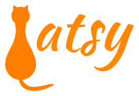
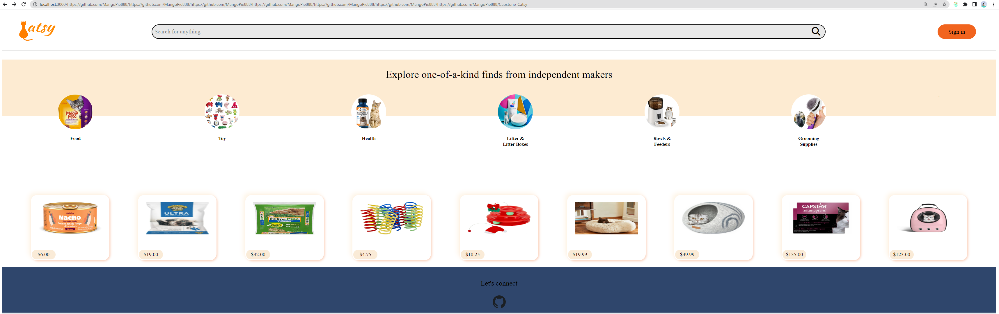
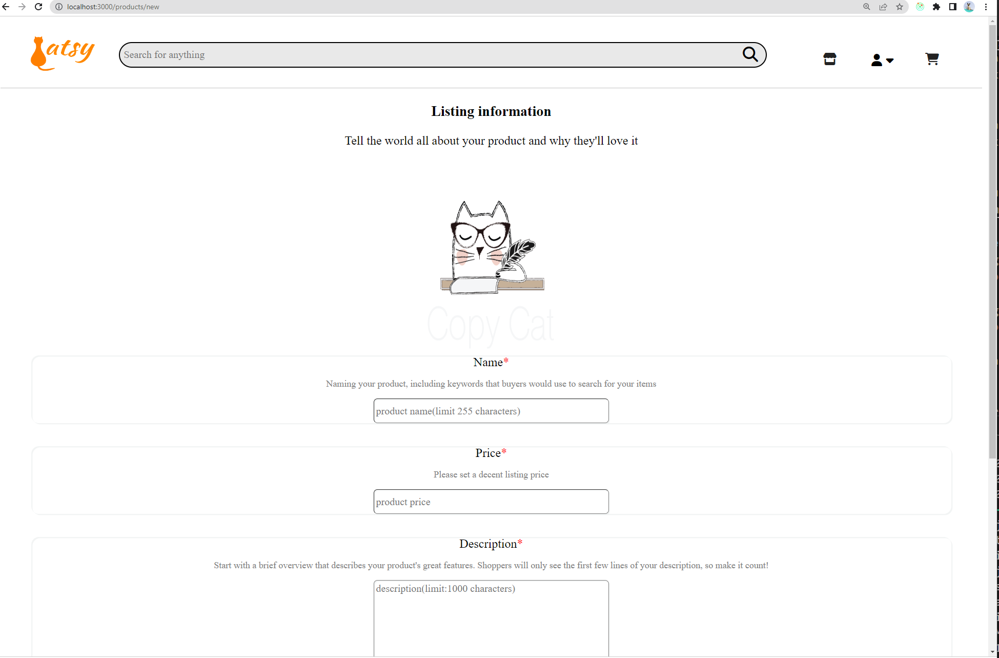
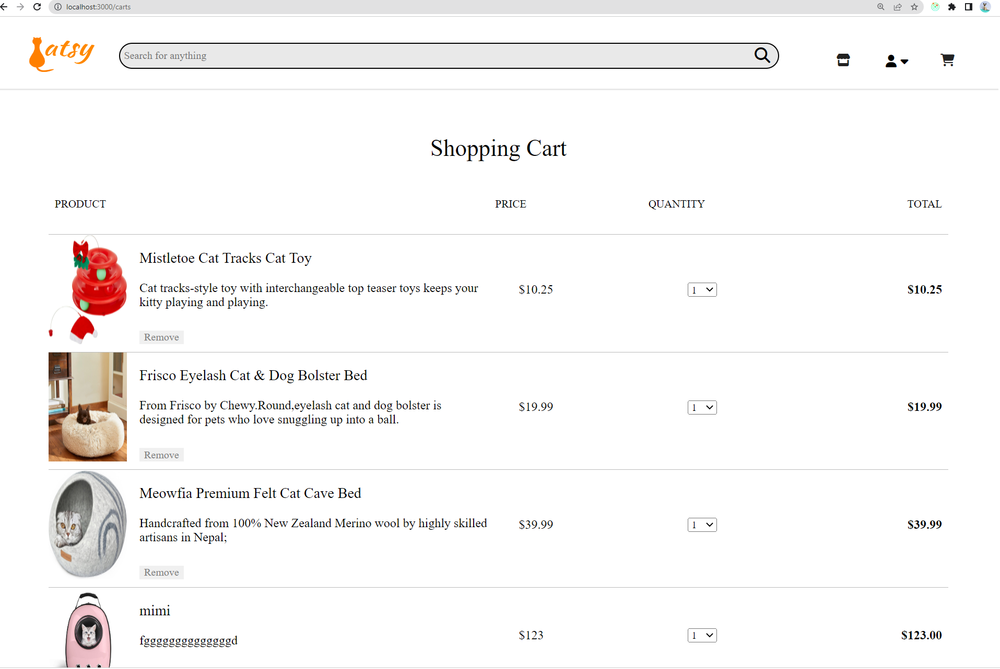

# Catsy

## What's this?
Catsy is a full-stack clone project that is originally cloned from Esty. It helps sellers and buyers to sell and buy their products about cats. This project aims for developers to practice using different technologies and build their web application from scratch.


## Languages and technology of Development
- Frontend: React, Redux , JavaScript
- Backend: Flask, SQLALchemy, Python
- Database: SQLite(local), PostgreSQL(live site)


## How to launch the full application locally
1. Clone this repository

2. Install dependencies

      ```bash
      pipenv install -r requirements.txt
      ```

3. Create a **.env** file based on the example with proper settings for your
   development environment

4. Make sure the SQLite3 database connection URL is in the **.env** file

5. This folder organizes all tables inside the `flask_schema` schema, defined
   by the `SCHEMA` environment variable.  Replace the value for
   `SCHEMA` with a unique name, **making sure you use the snake_case
   convention**.

6. Get into your pipenv, migrate your database, seed your database, and run your Flask app

   ```bash
   pipenv shell
   ```

   ```bash
   flask db upgrade
   ```

   ```bash
   flask seed all
   ```

   ```bash
   flask run
   ```

7. To run the React App in development, checkout the [README](./react-app/README.md) inside the `react-app` directory.

## Project Showcase
Home page


Listing product


Shopping cart



